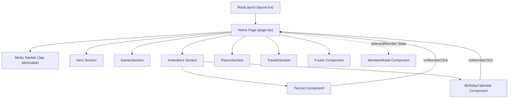

# System Architecture & Codebase Design

This document details the software architecture, component relationships, data layer patterns, and styling design tokens of the **GurruBoys** web application.

---

## 1. High-Level Architectural Overview

The application is structured as a high-performance, statically prerendered single-page web app built on **Next.js 16 (App Router)** and **React 19**. 

### Key Architectural Tenets:
1. **Data-Driven Architecture**: All dynamic content (members, tier ranking, RPG stats, games, trips, and venues) is stored in strongly typed TypeScript stores (`src/data/`). UI components render reactively from this single source of truth without requiring an external database.
2. **Static Prerendering (SSG)**: Because content is defined at build time, Next.js prerenders static HTML at compile time, providing sub-millisecond Time-To-First-Byte (TTFB) and high Core Web Vitals (CWV) performance.
3. **Neo-Brutalist Japanese Arcade UI**: The aesthetic blends Japanese anime typography, retro video game HUD elements, and neo-brutalist design rules (heavy black borders, asymmetric hard shadows, high contrast tier color coding).

---

## 2. Technology Stack

| Layer | Technology | Version | Rationale |
| :--- | :--- | :--- | :--- |
| **Framework** | Next.js (App Router) | `16.2.7` | Next-generation React framework with Turbopack for near-instant builds and static prerendering. |
| **UI Library** | React | `19.2.4` | Modern component-driven interface with first-class server component support. |
| **Type System** | TypeScript | `^5.0.0` | Strict static typing across domain models and component props. |
| **CSS & Design** | Tailwind CSS | `^4.0.0` | CSS-first configuration using `@tailwindcss/postcss` and `@theme inline`. |
| **Motion & Animation**| Framer Motion | `^12.40.0` | Declarative spring animations, hover physics, and modal mount/unmount orchestration (`AnimatePresence`). |
| **Iconography** | Lucide React | `^1.17.0` | Accessible, tree-shakeable SVG icons. |
| **Script Runner** | TSX | `^4.23.0` | Instant TypeScript script execution for QA data validation without manual compilation. |

---

## 3. Directory Layout & File Responsibilities

```text
gurrupage/
├── .github/
│   ├── workflows/
│   │   └── qa.yml              # CI automated QA pipeline (typecheck, lint, validate, build)
│   └── PULL_REQUEST_TEMPLATE.md# Standardized PR checklist for humans and AI
├── docs/                       # Complete engineering, QA, and AI operational documentation
│   ├── qa/                     # QA test strategy, test matrix, data integrity schemas
│   ├── workflows/              # Git workflow, PR procedures, AI Agent Playbook
│   ├── architecture.md         # System design and component hierarchy (this file)
│   ├── setup-and-installation.md# Setup, commands, and troubleshooting guide
│   └── README.md               # Documentation central index
├── public/                     # Static assets served at the root URL
│   ├── members/                # Standardized 640x640 portrait photos of members (.jpg)
│   ├── images/nacio/           # Travel photos for the Yu-Gi-Oh! National event
│   ├── quijano/                # Travel photos for the Campo Quijano event
│   ├── favicon.ico             # Card-back themed browser favicon
│   └── icon.png / apple-icon.png# App icons for web and mobile bookmarks
├── scripts/
│   └── validate-data.ts        # QA script auditing member birthdays, images, and content
├── src/
│   ├── app/
│   │   ├── globals.css         # Tailwind 4 theme, CSS variables, and Neo-Brutalist styles
│   │   ├── layout.tsx          # HTML root, Google Geist fonts, and metadata definition
│   │   └── page.tsx            # Main application page orchestrating all sections and modal state
│   ├── components/
│   │   ├── BirthdayCalendar.tsx# 12-month annual calendar, date parsing, upcoming birthdays
│   │   ├── Footer.tsx          # Social links, copyright, and bottom arcade banner
│   │   ├── GamesSection.tsx    # List of favorite card/board/party games
│   │   ├── Hero.tsx            # Hero visual header, title, badges, and Call-To-Action
│   │   ├── MemberModal.tsx     # Double-panel character profile & RPG stats sheet
│   │   ├── PlacesSection.tsx   # Dueling venues and group headquarters
│   │   ├── TierList.tsx        # S/A/B/C/D rank grid with interactive member tokens
│   │   └── TravelsSection.tsx  # Tournaments and vacation trips visual log
│   └── data/
│       ├── content.ts          # Static stores for games, venues, trips, and socials
│       └── members.ts          # Domain entities: members, tiers, birthdays, and skills
├── eslint.config.mjs           # Flat ESLint 9 configuration with Next.js rules
├── netlify.toml                # Netlify build and plugin configuration
├── next.config.ts              # Next.js configuration options
├── package.json                # Project dependencies, scripts, and QA commands
└── tsconfig.json               # TypeScript strict compiler options and path aliases (@/*)
```

---

## 4. Component Hierarchy & State Flow



### State Management:
- **`selectedMember`**: Owned by `src/app/page.tsx`. When a user clicks any member thumbnail in `TierList` or any upcoming birthday card in `BirthdayCalendar`, `setSelectedMember(member)` is called.
- **Modal Lifecycle**: `MemberModal` wraps the dialog inside `AnimatePresence`. When `selectedMember` is truthy, the backdrop and card animate into view with spring motion. Pressing ESC, clicking the close button (`X`), or clicking outside the card clears `selectedMember` back to `null`.

---

## 5. Domain Algorithms & Calculations

### 1. Character Power Rating (PWR) Formula
Located in `src/components/MemberModal.tsx`:
$$\text{Average PWR} = \text{round}\left(\frac{\sum_{i=1}^{N} \text{skill}[i].\text{level}}{N}\right)$$
- If a member has no skills recorded, the default power rating is fallback `50`.
- Skills with level `100` represent maxed-out / broken abilities (displayed with flame and alert indicators in the RPG tree).

### 2. Birthday Parsing & Distance Algorithm
Located in `src/components/BirthdayCalendar.tsx`:
- **`parseBirthday(bdayStr)`**:
  1. Filters out placeholder strings containing `'confirmar'`.
  2. Splits optional year suffix (`"18 de Oct - 2000"` ➔ `"18 de Oct"`).
  3. Splits by regex `/\s+de\s+/` to isolate the numeric day and Spanish month string.
  4. Resolves the month through `MONTH_MAP` (supporting both short `'sep'` and full `'septiembre'`).
- **`getUpcomingBirthdays()`**:
  1. Computes the offset in months: `diffMonth = parsed.month - todayMonth`.
  2. Computes the offset in days: `diffDay = parsed.day - todayDay`.
  3. If the date already passed in the current year, wraps around by adding 12 months.
  4. Approximates linear distance: `diffMonth * 30.4 + diffDay`.
  5. Sorts ascending and takes the top 4 members.

---

## 6. Design System & Style Tokens

Defined in `src/app/globals.css` using Tailwind CSS v4 `@theme inline`:

### Color Palette Tokens:
- **`--accent-black` (`#2c3e50`)**: Dominant outline color used for heavy borders and contrast text.
- **`--accent-red` (`#c0392b`)**: Primary brand accent color used for badges, tags, and highlights.
- **`--accent-gold` (`#f1c40f`)**: Secondary accent for medals, tier headers, and hover glows.
- **`--tier-s` (`#ff7f7f`)**: Red/coral tier highlight.
- **`--tier-a` (`#ffbf7f`)**: Orange tier highlight.
- **`--tier-b` (`#ffff7f`)**: Yellow tier highlight.
- **`--tier-c` (`#7fff7f`)**: Green tier highlight.
- **`--tier-d` (`#7fbfff`)**: Blue tier highlight.

### Signature Neo-Brutalist Classes:
- **`.japanese-border`**: `4px solid var(--accent-black)` with a `4px 4px 0px var(--accent-red)` hard drop shadow.
- **`.anime-text`**: Uppercase, font-weight 900, negative letter tracking (`-0.05em`), and italic slant.
- **Hard Drop Shadows**: Standard Tailwind arbitrary values: `shadow-[4px_4px_0px_#000]`, `shadow-[6px_6px_0px_#000]`, and `shadow-[8px_8px_0px_#000]`.
