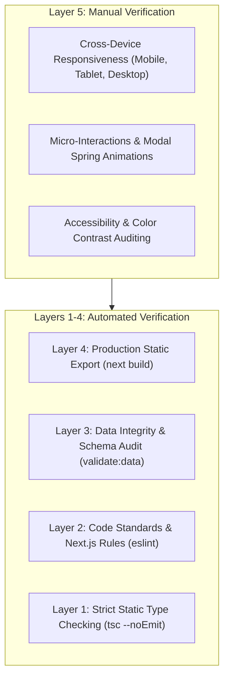

# Quality Assurance (QA) Strategy & Philosophy

This document outlines the overarching Quality Assurance strategy, testing pyramid, automated quality gates, and verification protocols for the **GurruBoys** web application.

---

## 1. QA Mission & Principles

The mission of QA in GurruBoys is to ensure that every update—whether made by human contributors or autonomous AI agents—guarantees **zero regressions**, adheres to strict data integrity standards, and preserves the vibrant visual design and responsiveness of the user experience.

### Core Principles:
1. **Static Verification First**: Catch structural errors, typos, and broken contracts at the compiler level before running code in a browser.
2. **Data Contract Invariance**: Content updates (such as birthdays, tier changes, member stats, or trip logs) must never break data parsing or crash components.
3. **Deterministic CI Pipeline**: No code can be merged into `main` without passing automated checks.
4. **Visual & Kinetic Fidelity**: The Neo-Brutalist styling, animations, modal transitions, and responsive grid layouts must remain uncompromised across all viewports.

---

## 2. The 5-Layer Testing Pyramid



### Layer 1: Static Type Checking (`tsc --noEmit`)
- **Tool**: TypeScript 5 in strict mode.
- **Coverage**: Validates component prop interfaces, domain type exports (`Member`, `Skill`), and ensures no invalid types or untyped props exist.
- **Run command**: `npm run typecheck`

### Layer 2: Code Quality & Core Web Vitals Linting (`eslint`)
- **Tool**: Flat ESLint 9 configuration with `eslint-config-next/core-web-vitals` and `eslint-config-next/typescript`.
- **Coverage**: Flags invalid React hooks usage, missing dependencies, deprecated Next.js APIs, and performance issues.
- **Run command**: `npm run lint`

### Layer 3: Data Integrity & Asset Audit (`validate:data`)
- **Tool**: Custom TypeScript validator executed via `tsx` (`scripts/validate-data.ts`).
- **Coverage**:
  - Validates all 20+ members have non-empty required fields.
  - Ensures member names are unique (no duplicates).
  - Validates tier membership matches `'S' | 'A' | 'B' | 'C' | 'D'`.
  - Checks birthday string formats against regex and Spanish month dictionaries.
  - Verifies that every local image referenced in `src/data/members.ts` and `src/data/content.ts` actually exists on the filesystem in `public/`.
  - Validates skill arrays, numeric levels, and content stores (games, places, travels, socials).
- **Run command**: `npm run validate:data`

### Layer 4: Static Site Generation & Production Build (`next build`)
- **Tool**: Next.js 16 Turbopack compiler.
- **Coverage**: Pre-renders all pages and verifies that zero hydration mismatches, missing imports, or runtime bundling errors occur.
- **Run command**: `npm run build`

### Layer 5: Manual & Exploratory UI Smoke Testing
- **Tool**: Browser DevTools, physical devices, responsive viewport simulators.
- **Coverage**: Validates modal trigger behavior, responsive breakpoints, image aspect ratios, and calendar day selection.
- **Reference**: Detailed in [`docs/qa/qa-checklist-and-test-cases.md`](./qa-checklist-and-test-cases.md).

---

## 3. Automated CI/CD Quality Gates

Every push and Pull Request triggers the GitHub Actions workflow defined in `.github/workflows/qa.yml`. 

### Pipeline Gates:

```text
┌──────────────────────────────────────────────────────────┐
│              GitHub Actions: QA Pipeline                 │
├──────────────────────────────────────────────────────────┤
│  1. npm ci                                               │
│  2. npm run typecheck     ──► Fail on TypeScript errors  │
│  3. npm run lint          ──► Fail on ESLint errors      │
│  4. npm run validate:data ──► Fail on data/asset issues  │
│  5. npm run build         ──► Fail on compilation errors │
│  6. Netlify Deploy Preview──► Visual preview generation  │
└──────────────────────────────────────────────────────────┘
```

If **any** gate fails, the PR is automatically marked as blocked, preventing merging into `main`.

---

## 4. One-Command QA Protocol

Before submitting changes, developers and AI agents must run:

```bash
npm run qa
```

This aggregates all four automated gates in a single sequential command. If this command finishes with exit code `0`, the codebase is verified and safe for pull request creation.

---

## 5. Non-Functional Testing Dimensions

| Dimension | Target Metric | Verification Method |
| :--- | :--- | :--- |
| **Performance (LCP)** | Largest Contentful Paint $< 2.5\text{s}$ | Chrome DevTools Lighthouse / Core Web Vitals audit. |
| **Performance (CLS)** | Cumulative Layout Shift $< 0.1$ | Ensure fixed dimensions on images and modals. |
| **Responsiveness** | Flawless rendering from $375\text{px}$ to $4\text{K}$ | Manual viewport resizing in Chrome DevTools. |
| **Accessibility (a11y)** | WCAG 2.1 Level AA | Meaningful `alt` tags on photos, focus outlines on interactive buttons, keyboard ESC dismiss for modals. |
